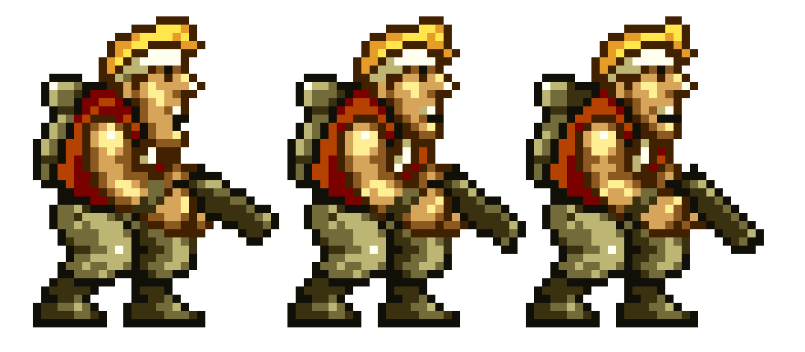
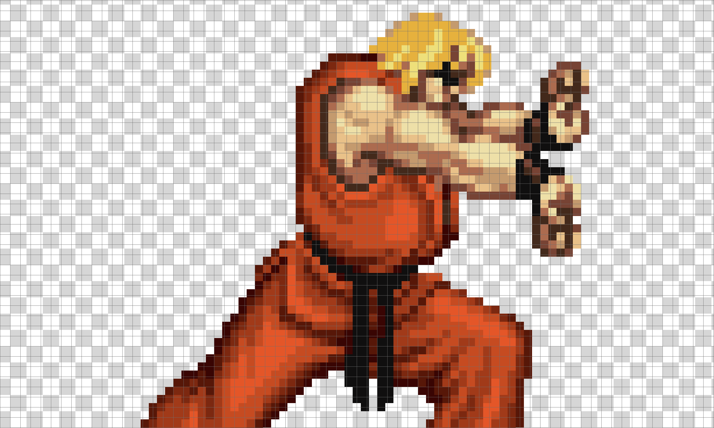
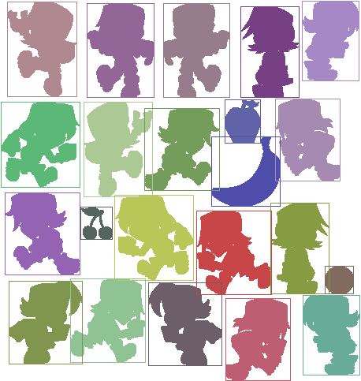

# Sprite Detection

## Sprite

A [**sprite**](<https://en.wikipedia.org/wiki/Sprite_(computer_graphics)>) is a small [**raster graphic**](https://en.wikipedia.org/wiki/Raster_graphics) (a **bitmap**) that represents an object such as a [character, a vehicle, a projectile, etc.](https://www.youtube.com/watch?v=a1yBP5t-fSA)


Sprites are a popular way to create large, complex scenes as you can manipulate each sprite separately from the rest of the scene. This allows for greater control over how the scene is rendered, as well as over how the players can interact with the scene.

Sprites are mainly used in 2D video games, such as [Shoot'em up](https://en.wikipedia.org/wiki/Shoot_%27em_up) in which the hero combats a large number of enemies by shooting at them while dodging their fire:

| [Cannon Fodder](<https://en.wikipedia.org/wiki/Cannon_Fodder_(video_game)>) | [Commando](<https://en.wikipedia.org/wiki/Commando_(video_game)>) | [Metal Slug](https://en.wikipedia.org/wiki/Metal_Slug) |
| --------------------------------------------------------------------------- | ----------------------------------------------------------------- | ------------------------------------------------------ |
|                            |                            |             |

## Sprite Animation

Several sprites, representing a same object, can be rendered in quick succession to give the illusion of movement of this object (**animation**).

For example, the animation of the hero Marco Rossi (Metal Slug), running with a gun, is composed of 9 sprites:


## Sprite Sheet

It is not uncommon for games to have tens to hundreds of sprites. Loading each of these as an individual image would consume a lot of memory and processing power. To help manage sprites and avoid using so many images, many games use [**sprite sheets**](https://www.youtube.com/watch?v=crrFUYabm6E) (also known as **image sprites**).

A sprite sheet consists of multiple sprites in one image. In other words, sprite sheets pack multiple sprites into a single picture. Using sprite sheet, video game developers create sprite sheet animation representing one or several animation sequences while only loading a single file:


## Sprite Bounding Box

A frame (**bounding box**) can be used to delimit the sprite in the sprite sheet. This bounding box is defined with two 2D points `top_left` and the `bottom_right`, which their respective coordinates `x` and `y` are relative to the top-left corner of the sprite sheet's image.

For example:


## Sprite Mask

The mask of a sprite defines the 2D shape of the sprite. For example, the sprite sheet [`metal_slug_sprite_standing_stance.png`](metal_slug_sprite_standing_stance_large.png) contains the 3 following sprites:



The masks of these sprites are respectively:


## Optimized Sprite Sheet

Sprites could be evenly placed in the sprite sheet according to their bounding box. The disadvantage is that this method of placement wastes a lot of memory because of all the additional transparency of each sprite, especially when sprites have different width and height.

The developers are aware of the wasted memory and started to optimize the space in the sprite sheets. Sprites are placed close to each others, depending on their shape. The bounding box of a sprite may intersect the bounding box of another sprite, but the shape of this sprite is always separated from the shape of any other sprites with at least 1 transparent pixel.


This space optimization is even more efficient when some big sprites have concave shape (i.e., shape that curves inward):

| Scene with 2 Sprites    | Sprite Sheet                                 | Sprite Masks                                      |
| ----------------------- | -------------------------------------------- | ------------------------------------------------- |
|  |  |  |

# Waypoint 1: Find the Most Common Color in an Image

**YOU WILL CREATE A PYTHON FILE `spriteutil.py` WHERE YOU WILL EDIT YOUR CODE.**

Write a function `find_most_common_color` that takes an argument `image` (a [`Image`](https://pillow.readthedocs.io/en/stable/reference/Image.html) object) and that returns the [pixel color](https://www.youtube.com/watch?v=15aqFQQVBWU) that is the most used in this image.

The data type of the value returned depends on the [image's mode](https://pillow.readthedocs.io/en/stable/handbook/concepts.html#concept-modes):

- an integer if the mode is grayscale;
- a tuple `(red, green, blue)` of integers (0 to 255) if the mode is `RGB`;
- a tuple `(red, green, blue, alpha)` of integers (0 to 255) if the mode is `RGBA`.

_Note: the component `alpha` (`A`) corresponds to how much the pixel is **opaque** (i.e., how much the pixel is not **transparent**). `0` means the pixel is not opaque, the pixel is fully transparent, its color `RGB` is actually not displayed. `255` means the pixel is fully opaque, the pixel is not transparent at all, its color `RGB` is fully displayed._

For example:

```python
>>> from PIL import Image
# JPEG image
>>> image = Image.open('islands.jpg')
>>> image.mode
'RGB'
>>> find_most_common_color(image)
(0, 221, 204)
# PNG image
>>> image = Image.open('metal_slug_sprite_standing_stance_large.png')
>>> image.mode
'RGBA'
>>> find_most_common_color(image)
(0, 0, 0, 0)
# Grayscale image
>>> image = image.convert('L')
>>> image.mode
'L'
>>> find_most_common_color(image)
0
```

<em>Note 1: Python is an interpreted, high-level, general-purpose programming language. Pure Python code is not great at processing large amount of data. However, Python comes with a large number of libraries written in [`C`](<https://en.wikipedia.org/wiki/C_(programming_language)>) that run very fast: [`Pillow`](https://en.wikipedia.org/wiki/Python_Imaging_Library) for image processing, [`NumPy`](https://en.wikipedia.org/wiki/NumPy) for large multi-dimensional arrays and matrices, etc. You SHOULD intensively use these libraries that extend Python and that allow your Python application to be fast.</em>

_Note 2: You SHOULD [measure the execution time](https://docs.python.org/3.7/library/timeit.html) of your code to check whether it's reasonably fast or if there is space for improvement. For example:_

```python
>>> import timeit
>>> from PIL import Image
>>> image = Image.open('islands.jpg')
>>> timeit.timeit(stmt=lambda: find_most_common_color(image), number=1)
1.6871624910000023
```

# Waypoint 2: Write a Class `Sprite`

Write a class `Sprite` which constructor takes 5 arguments `label`, `x1`, `y1`, `x2`, and `y2` ([whole numbers](https://en.wikipedia.org/wiki/Integer)). These arguments are used to initialize private attributes of the class `Sprite`.

Add the read-only property `label` to the class `Sprite` that returns the label of the sprite.

Add the two read-only properties `top_left` and `bottom_right` to the class `Sprite` that correspond to the coordinates `(x1, y1)` (a tuple) of the top-left corner, respectively the coordinates `(x2, y2)` (a tuple) of the right-most corner.

For example:

```python
>>> sprite = Sprite(1, 12, 23, 145, 208)
>>> sprite.label
1
>>> sprite.top_left
(12, 23)
>>> sprite.bottom_right
(145, 208)
```

The constructor of the class `Sprite` raises an exception `ValueError` if one or more arguments `label`, `x1`, `y1`, `x2`, and `y2` is not positive integer, or if the arguments `x2` and `y2` is not equal or greater respectively than `x1` and `y1`.

For examples:

```python
>>> sprite = Sprite(1, -1, 0, 0, 0)
Traceback (most recent call last):
  File "<input>", line 1, in <module>
  File "<input>", line 11, in __init__
ValueError: Invalid coordinates
>>> sprite = Sprite(1, "Hello", 0, 0, 0)
Traceback (most recent call last):
  File "<input>", line 1, in <module>
  File "<input>", line 13, in __init__
ValueError: Invalid coordinates
>>> sprite = Sprite(1, 1, 0, 0, 0)
Traceback (most recent call last):
  File "<input>", line 1, in <module>
  File "<input>", line 13, in __init__
ValueError: Invalid coordinates
```

Add the two properties `width` and `height` that returns respectively the number of pixels horizontally and vertically of this sprite.

For example:

```python
>>> sprite = Sprite(1, 12, 23, 145, 208)
>>> sprite.width
134
>>> sprite.height
186
```

# Waypoint 3: Find Sprites in an Image

We would like to identify all the sprites packed in a single picture.

## Background Color

You need to implement an [image segmentation algorithm](./b5034b2ce2bdf21e09d3915207d7b824ceb4.pdf) that considers the color of each pixel of a specified picture to determine whether this pixel belongs to a sprite or not:

- pixels which color **corresponds to the _background_ color** of the picture are considered as **transparent**, i.e., they don't belong to a sprite;

- pixels which color is **different from the _background_ color** of the picture are considered as **solid**, i.e., they belong to a sprite.

The background color of a sprite sheet generally corresponds to the most common color of the image.

For examples:

| Opaque Background Color (RGB model)                                                     | Transparent Background Color (RGBA model)                                                         |
| --------------------------------------------------------------------------------------- | ------------------------------------------------------------------------------------------------- |
|  |  |

In the RGB model example, the sprites of [Ken](https://en.wikipedia.org/wiki/Ken_Masters) are drawn on an opaque background composed of pixels with the color [`RGB(128, 184, 168)`](https://www.colorhexa.com/80b8a8):


This slightly desaturated cyan (lime green) background color should be considered as as _transparent_ color. Our image segmentation algorithm MUST ignore pixels of this color; these pixels are considered as not part of any sprites.

In the RGBA model example, the sprites of Ken are drawn on an transparent background composed of pixels with a color which `alpha` component is `0` (i.e., not opaque at all, totally transparent):



In that case, our image segmentation algorithm MUST ignore pixels with `alpha` component equal to `0`; these pixels are considered as not part of any sprites.

## Pixel Connectivity

Sprites correspond to smaller images composed of [connected pixels](https://en.wikipedia.org/wiki/Pixel_connectivity), meaning that each pixel of a sprite is adjacent to at least one of its direct neighbor pixels ([8-neighborhood connectivity method](4d991f5902c84c2181c6c573661abdc228b1.pdf)):

|                                                   |                                                                                         |
| ------------------------------------------------- | --------------------------------------------------------------------------------------- |
|  |  |

Your image segmentation algorithm needs to isolate each sprite, producing bounding boxes with correct sizes and identifying isolated parts of a sprite as an included segment.

## Requirements

Write a function `find_sprites` that takes an argument `image` (an [`Image`](https://pillow.readthedocs.io/en/stable/reference/Image.html) object).

This function accepts an optional argument `background_color` (an integer if the image format is grayscale, or a tuple `(red, green, blue)` if the image format is `RGB`) that identifies the background color (i.e., transparent color) of the image. The function ignores any pixels of the image with this color.

If this argument `background_color` is not passed, the function determines the background color of the image as follows:

1. The image, such as a PNG file, has an [alpha channel](<https://en.wikipedia.org/wiki/Transparency_(graphic)>): the function ignores all the pixels of the image which alpha component is `0`;

2. The image has no alpha channel: the function identifies the most common color of the image as the background color (cf. our function `find_most_common_color`).

The function returns a tuple `(sprites, label_map)` where:

- `sprites`: A collection of key-value pairs (a dictionary) where each key-value pair maps the key (the label of a sprite) to its associated value (a `Sprite` object);

- `label_map`: A 2D array of integers of equal dimension (width and height) as the original image where the sprites are packed in. The `label_map` array maps each pixel of the image passed to the function to the label of the sprite this pixel corresponds to, or `0` if this pixel doesn't belong to a sprite (e.g., background color).

_Note: The sprite labels can be whatever unique strictly positive integers, with no particular order. The index of a sprite has no particular relationship with the position of the sprite in the image._

**WARNING: You are NOT ALLOWED to use any computer vision libraries (e.g. [OpenCV](https://opencv.org/) and others), but only image processing (e.g., [Python Image Library](https://python-pillow.org/)) and scientific computing (e.g, [Numpy](https://numpy.org/)) libraries!**

For example, let's consider the image file [sprite_example.png](metal_slug_single_sprite.png) zoomed-in hereafter:


```python
>>> from PIL import Image
>>> image = Image.open('metal_slug_single_sprite.png')
>>> sprites, label_map = find_sprites(image, background_color=(255, 255, 255))
>>> len(sprites)
1
>>> for label, sprite in sprites.items():
...     print(f"Sprite ({label}): [{sprite.top_left}, {sprite.bottom_right}] {sprite.width}x{sprite.height}")
Sprite (1): [(0, 0), (29, 37)] 30x38
>>> import pprint
>>> pprint.pprint(label_map, width=120)
[[0,0,0,0,0,0,0,0,0,0,0,0,0,0,0,1,1,1,1,0,0,0,0,0,0,0,0,0,0,0],
 [0,0,0,0,0,0,0,0,0,0,0,0,1,1,1,1,1,1,1,1,0,0,0,0,0,0,0,0,0,0],
 [0,0,0,0,0,0,0,0,0,0,1,1,1,1,1,1,1,1,1,1,0,0,0,0,0,0,0,0,0,0],
 [0,0,0,0,0,0,0,0,0,1,1,1,1,1,1,1,1,1,1,1,1,0,0,0,0,0,0,0,0,0],
 [0,0,0,0,0,0,0,0,0,1,1,1,1,1,1,1,1,1,1,1,0,0,0,0,0,0,0,0,0,0],
 [0,0,0,0,0,0,0,0,1,1,1,1,1,1,1,1,1,1,1,0,0,0,0,0,0,0,0,0,0,0],
 [0,0,0,0,0,0,0,0,1,1,1,1,1,1,1,1,1,1,1,0,0,0,0,0,0,0,0,0,0,0],
 [0,0,1,1,1,1,0,0,1,1,1,1,1,1,1,1,1,1,1,1,0,0,0,0,0,0,0,0,0,0],
 [0,1,1,1,1,1,1,1,1,1,1,1,1,1,1,1,1,1,1,1,1,0,0,0,0,0,0,0,0,0],
 [0,1,1,1,1,1,1,1,1,1,1,1,1,1,1,1,1,1,1,1,0,0,0,0,0,0,0,0,0,0],
 [0,1,1,1,1,1,1,1,1,1,1,1,1,1,1,1,1,1,1,0,0,0,0,0,0,0,0,0,0,0],
 [0,0,1,1,1,1,1,1,1,1,1,1,1,1,1,1,1,1,1,0,0,0,0,0,0,0,0,0,0,0],
 [0,0,1,1,1,1,1,1,1,1,1,1,1,1,1,1,1,1,1,0,0,0,0,0,0,0,0,0,0,0],
 [0,1,1,1,1,1,1,1,1,1,1,1,1,1,1,1,1,1,0,0,0,0,0,0,0,0,0,0,0,0],
 [0,1,1,1,1,1,1,1,1,1,1,1,1,1,1,1,1,1,1,0,0,0,0,0,0,0,0,0,0,0],
 [1,1,1,1,1,1,1,1,1,1,1,1,1,1,1,1,1,1,1,0,0,0,0,0,0,0,0,0,0,0],
 [1,1,1,1,1,1,1,1,1,1,1,1,1,1,1,1,1,1,0,0,0,0,0,0,0,0,0,0,0,0],
 [1,1,1,1,1,1,1,1,1,1,1,1,1,1,1,1,1,1,0,0,0,0,0,0,0,0,0,0,0,0],
 [1,1,1,1,1,1,1,1,1,1,1,1,1,1,1,1,1,1,1,1,1,0,0,0,0,0,0,0,0,0],
 [1,1,1,1,1,1,1,1,1,1,1,1,1,1,1,1,1,1,1,1,1,1,1,0,0,0,0,0,0,0],
 [0,1,1,1,1,1,1,1,1,1,1,1,1,1,1,1,1,1,1,1,1,1,1,1,0,0,0,0,0,0],
 [0,0,0,1,1,1,1,1,1,1,1,1,1,1,1,1,1,1,1,1,1,1,1,1,1,1,0,0,0,0],
 [0,0,0,1,1,1,1,1,1,1,1,1,1,1,1,1,1,1,1,1,1,1,1,1,1,1,1,0,0,0],
 [0,0,1,1,1,1,1,1,1,1,1,1,1,1,1,1,1,1,1,1,1,1,1,1,1,1,1,1,1,0],
 [0,0,1,1,1,1,1,1,1,1,1,1,1,1,1,1,1,1,1,1,1,1,1,1,1,1,1,1,1,1],
 [0,0,1,1,1,1,1,1,1,1,1,1,1,1,1,1,1,1,1,1,1,1,0,1,1,1,1,1,1,1],
 [0,0,0,1,1,1,1,1,1,1,1,1,1,1,1,1,1,1,1,1,1,0,0,0,0,1,1,1,1,0],
 [0,0,0,1,1,1,1,1,1,1,1,1,1,1,1,1,1,1,1,1,0,0,0,0,0,0,1,1,0,0],
 [0,0,0,0,1,1,1,1,1,1,1,1,1,1,1,1,1,1,1,1,0,0,0,0,0,0,0,0,0,0],
 [0,0,0,0,1,1,1,1,1,1,1,1,1,1,1,1,1,1,1,1,0,0,0,0,0,0,0,0,0,0],
 [0,0,0,1,1,1,1,1,1,1,1,1,1,1,1,1,1,1,1,1,0,0,0,0,0,0,0,0,0,0],
 [0,0,0,1,1,1,1,1,1,1,1,1,1,1,1,1,1,1,1,0,0,0,0,0,0,0,0,0,0,0],
 [0,0,1,1,1,1,1,1,1,1,0,0,1,1,1,1,1,0,0,0,0,0,0,0,0,0,0,0,0,0],
 [0,1,1,1,1,1,1,1,0,0,0,0,1,1,1,1,1,0,0,0,0,0,0,0,0,0,0,0,0,0],
 [0,1,1,1,1,1,1,0,0,0,0,0,1,1,1,1,1,1,0,0,0,0,0,0,0,0,0,0,0,0],
 [1,1,1,1,1,1,1,1,0,0,0,1,1,1,1,1,1,1,1,0,0,0,0,0,0,0,0,0,0,0],
 [1,1,1,1,1,1,1,1,1,0,0,1,1,1,1,1,1,1,1,1,1,0,0,0,0,0,0,0,0,0],
 [1,1,1,1,1,1,1,1,1,0,0,1,1,1,1,1,1,1,1,1,1,0,0,0,0,0,0,0,0,0]]
```

Other example with the following image:


```python
>>> from PIL import Image
>>> image = Image.open('optimized_sprite_sheet.png')
>>> sprites, label_map = find_sprites(image)
>>> len(sprites)
22
>>> for label, sprite in sprites.items():
...     print(f"Sprite ({label}): [{sprite.top_left}, {sprite.bottom_right}] {sprite.width}x{sprite.height}")
Sprite (25): [(383, 1), (455, 102)] 73x102
Sprite (43): [(9, 2), (97, 122)] 89x121
Sprite (26): [(110, 4), (195, 123)] 86x120
Sprite (46): [(207, 4), (291, 123)] 85x120
Sprite (16): [(305, 8), (379, 123)] 75x116
Sprite (53): [(349, 125), (431, 229)] 83x105
Sprite (61): [(285, 126), (330, 181)] 46x56
Sprite (100): [(1, 129), (101, 237)] 101x109
Sprite (106): [(106, 129), (193, 249)] 88x121
Sprite (93): [(183, 137), (278, 241)] 96x105
Sprite (95): [(268, 173), (355, 261)] 88x89
Sprite (178): [(6, 244), (101, 348)] 96x105
Sprite (185): [(145, 247), (245, 355)] 101x109
Sprite (141): [(343, 257), (417, 372)] 75x116
Sprite (169): [(102, 262), (142, 303)] 41x42
Sprite (188): [(249, 267), (344, 373)] 96x107
Sprite (192): [(412, 337), (448, 372)] 37x36
Sprite (256): [(89, 353), (184, 459)] 96x107
Sprite (234): [(11, 356), (104, 461)] 94x106
Sprite (207): [(188, 358), (281, 463)] 94x106
Sprite (229): [(384, 374), (456, 475)] 73x102
Sprite (248): [(286, 378), (368, 482)] 83x105
```

# Waypoint 4: Draw Sprite Label Bounding Boxes

Write a function `create_sprite_labels_image` that takes two arguments `sprites` and `label_map`, the same returned by the function `find_sprites`.

The function `create_sprite_labels_image` accepts an optional argument `background_color` (either a tuple `(R, G, B)` or a tuple `(R, G, B, A)`) that identifies the color to use as the background of the image to create. If this argument is not passed to the function, the default value is `(255, 255, 255)`.

The function `create_sprite_labels_image` returns an image of equal dimension (width and height) as the original image that was passed to the function `find_sprites`.

The function `create_sprite_labels_image` draws the masks of the sprites at the exact same position that the sprites were in the original image. The function draws each sprite mask with a random uniform color (one color per sprite mask). The function also draws a rectangle (bounding box) around each sprite mask, of the same color used for drawing the sprite mask.

For example:

```python
>>> from PIL import Image
>>> image = Image.open('optimized_sprite_sheet.png')
>>> sprites, label_map = find_sprites(image)
>>> # Draw sprite masks and bounding boxes with the default white background color.
>>> sprite_label_image = create_sprite_labels_image(sprites, label_map)
>>> sprite_label_image.save('optimized_sprite_sheet_bounding_box_white_background.png')
>>> # Draw sprite masks and bounding boxes with a transparent background color.
>>> sprite_label_image = create_sprite_labels_image(sprites, label_map, background_color=(0, 0, 0, 0))
>>> sprite_label_image.save('optimized_sprite_sheet_bounding_box_transparent_background.png')
```

| Sprite Masks with White Background                            | Sprite Masks with Transparent Background                            |
| ------------------------------------------------------------- | ------------------------------------------------------------------- |
|  |  |

# Waypoint 5: Write a Class `SpriteSheet`

Write a class `SpriteSheet` which constructor accepts an argument `fd` that corresponds to either:

- the name and path (a string) that references an image file in the local file system;
- a [`pathlib.Path`](https://docs.python.org/3/library/pathlib.html#pathlib.Path) object that references an image file in the local file system ;
- a [file object](https://docs.python.org/3/glossary.html#term-file-object) that MUST implement [`read()`](https://docs.python.org/3/library/io.html#io.IOBase.read), [`seek()`](https://docs.python.org/3/library/io.html#io.IOBase.seek), and [`tell()`](https://docs.python.org/3/library/io.html#io.IOBase.tell) methods, and be opened in binary mode;
- a [`Image`](https://pillow.readthedocs.io/en/stable/reference/Image.html) object.

This constructor also accepts an optional argument `background_color` that identifies the background color (i.e., transparent color) of the image. The type of `background_color` argument depends on the images' mode:

- an integer if the mode is grayscale;
- a tuple `(red, green, blue)` of integers if the mode is `RGB`;
- a tuple `(red, green, blue, alpha)` of integers if the mode is `RGBA`. The `alpha` element is optional. If not defined, while the image mode is `RGBA`, the constructor considers the `alpha` element to be `255`.

Integrate the function `find_most_common_color` as a static method of the class `SpriteSheet`.

Add a read-only property `background_color` that returns the background color of the image that was passed to the constructor of the class `SpriteSheet`. If the argument `background_color` that was passed to the constructor of this class was `None`, the function of the read-only property `background_color` calls the static method `find_most_common_color` to determine the background color of the image, otherwise the function simply returns the value of the argument `background_color` that was passed.

Integrate the function `find_sprites` as an instance method of the class `SpriteSheet`. You need to remove the optional argument `background_color` of this function; you need to use the private attribute of the class `SpriteSheet` that references the background color of the image of this sprite sheet.

If your function `find_sprites` was using some other functions, these functions need to be integrated to the class `SpriteSheet` (more likely as private methods).

Integrate the function `create_sprite_labels_image` as an instance method of the class `SpriteSheet`. You need to remove all the arguments `sprites` and `label_map`, and you need to use the respective instance private attributes of the class `SpriteSheet` instead.

# Waypoint 6: Package and Distribute the Python Library

We would like to [package our Python library](https://packaging.python.org/tutorials/packaging-projects/) and distribute it through the [Python Package Index](https://pypi.org/). That would allow other Python developer to reuse our Python library and to integrate it to their own project(s).

## Install Python Build and Distribution Tools

To package and distribute a Python library, you need to install the following additional Python libraries:

- [`setuptools`](https://github.com/pypa/setuptools): A collection of enhancements to the Python [distutils](https://docs.python.org/3/distutils/) that allow developers to more easily build and distribute Python distributions, especially ones that have dependencies on other packages
- [`wheel`](https://pythonwheels.com/): A `setuptools` extension for creating _wheel_ distributions
- [`twine`](https://github.com/pypa/twine): A utility for interacting with the Python Package Index, which we present later in this waypoint, when you will publish your Python library

```bash
$ pipenv install setuptools wheel twine
```

## Create the Package Files

You need to add 3 following files to your Python project:

- `LICENSE`: An [open source license](https://choosealicense.com/) to make it easier for other people to contribute. We will choose the MIT license;
- `README.md`: The documentation of our Python library, written using [Markdown markup](https://en.wikipedia.org/wiki/Markdown);
- `setup.py`: a build script for [setuptools](https://packaging.python.org/key_projects/#setuptools). It tells `setuptools` about your package (such as the name and version) as well as which code files to include.

### `LICENSE`

We will release our Python library under the [MIT license](https://opensource.org/licenses/MIT).

The [Massachusetts Institute of Technology (MIT)](https://en.wikipedia.org/wiki/Massachusetts_Institute_of_Technology) license is a permissive free software license that puts only very limited restriction on reuse. It permits reuse within proprietary software provided that all copies of the licensed software include a copy of the MIT License terms and the copyright notice.

The MIT license is also compatible with the [GNU General Public License (GPL)](https://en.wikipedia.org/wiki/GNU_General_Public_License), but a lot less restrictive; MIT licensed software can be integrated into GPL software, but not the other way around.

Create a `LICENSE` file at the root of your Python project and enter the following content:

```text
MIT License

Copyright (C) 2019 Intek Institute.  All rights reserved.

Permission is hereby granted, free of charge, to any person obtaining
a copy of this software and associated documentation files (the
"Software"), to deal in the Software without restriction, including
without limitation the rights to use, copy, modify, merge, publish,
distribute, sublicense, and/or sell copies of the Software, and to
permit persons to whom the Software is furnished to do so, subject to
the following conditions:

The above copyright notice and this permission notice shall be
included in all copies or substantial portions of the Software.

THE SOFTWARE IS PROVIDED "AS IS", WITHOUT WARRANTY OF ANY KIND,
EXPRESS OR IMPLIED, INCLUDING BUT NOT LIMITED TO THE WARRANTIES OF
MERCHANTABILITY, FITNESS FOR A PARTICULAR PURPOSE AND NONINFRINGEMENT.
IN NO EVENT SHALL THE AUTHORS OR COPYRIGHT HOLDERS BE LIABLE FOR ANY
CLAIM, DAMAGES OR OTHER LIABILITY, WHETHER IN AN ACTION OF CONTRACT,
TORT OR OTHERWISE, ARISING FROM, OUT OF OR IN CONNECTION WITH THE
SOFTWARE OR THE USE OR OTHER DEALINGS IN THE SOFTWARE.
```

### `README.md`

You need to create a `README.md` file at the root of your Python project to tell other people why your project is useful, what they can do with your project, and how they can use it.

A `README.md` file, along with a project license, helps you communicate expectations for and manage contributions to your project.

A `README.md` file typically [includes information](https://github.com/18F/open-source-guide/blob/18f-pages/pages/making-readmes-readable.md) on:

- What the project does
- Why the project is useful
- How users can get started with the project
- Where users can get help with your project
- Who maintains and contributes to the project

You will use [Markdown markup](https://www.markdownguide.org/) to edit the content of your `README.md` file.

### `setup.py`

Create a `setup.py` file at the root of your project and edit its content according to the [Python Packaging Documentation](https://packaging.python.org/tutorials/packaging-projects/#creating-setup-py).

Your `setup.py` file MUST reference the MIT license and it MUST include the content of your `README.md`.

Your `setup.py` SHOULD include the following Python script headers (metadata variables, also known as [module level dunder names](https://www.python.org/dev/peps/pep-0008/#module-level-dunder-names)):

- `__author__`
- `__copyright__`: such as `Copyright (C) 2019, Intek Institute`
- `__credits__`
- `__email__`: your email address
- `__license__`: `MIT`
- `__maintainer__`: your name
- `__version__`: a version respecting [PEP 396](https://www.python.org/dev/peps/pep-0396/), such as a [Semantic version](https://semver.org/)

You SHOULD definitively reuse these metadata in the `setuptools.setup` section of your `setup.py` file. For exampple

```python
__author__ = 'Daniel CAUNE'
__email__ = 'daniel.caune@gmail.com'
__version = '1.0.0'

setuptools.setup(
    author=__author__,
    author_email=__email__,
    ...
    version=__version__
)
```

Most importantly, you MUST specify the optional argument [`install_requires`](https://packaging.python.org/guides/distributing-packages-using-setuptools/#install-requires) to indicate the list of third-party Python libraries your project requires (such as `Pillow` and probably `Numpy`). Indeed, you SHOULD NOT specify manually this list; you SHOULD generate this list. You can use something like:

```python
import pipfile
pf = pipfile.load('LOCATION_OF_PIPFILE')
print(pf.data['default'])
```

_Note: This code has a drawback. Importing `pipfile` means the user needs to actually install that before trying installing your package. The `setup.py` SHOULD only depend on `setuptools`. There are a few options, such as [`pipenv_setup`](https://github.com/Madoshakalaka/pipenv-setup)._

## Package your Library

You need to [package your library into a distribution archive](https://packaging.python.org/tutorials/packaging-projects/#generating-distribution-archives) that we will later upload to the Python Package Index for other users to download and install using `pip`.

Run the following command from the same directory where your `setup.py` file is located:

```bash
$ python setup.py sdist bdist_wheel
```

This command generate two files in the `dist` directory that are named with the arguments `name` and `version` you have passed to the `setuptools.setup` function.

For example:

```bash
$ ls -1 dist
spriteutil-1.0.0.tar.gz
spriteutil-1.0.0-py3-none-any.whl
```

**YOU MUST NOT ADD TO YOUR GIT REPOSITORY ANY FILES AND DIRECTORIES THAT HAVE BEEN GENERATED!**

_Note: When you fix issues in your code, or add new features, you increment accordingly the version of your library, and you rebuilt the distribution archive of your library. You will end-up with several distribution archives in your directory `dist`:_

```bash
$ ls -1 dist
spriteutil-1.0.0.tar.gz
spriteutil-1.0.1.tar.gz
spriteutil-1.0.0-py3-none-any.whl
spriteutil-1.0.1-py3-none-any.whl
```

_You might want to cleanse the directories `build` and `dist` before generating a new distribution archive:_

```bash
$ rm -Rfv build dist && python setup.py sdist bdist_wheel
```

## Generate and Publish your Distribution Archive

To allow other users to search for your Python library, and to download and install it, you need to upload it to the [Python Package Index (PyPI)](https://pypi.org/), the official third-party software repository for Python:


Publishing your Python libary to the Python Package Index will allow other users to [install it using `pip`](https://packaging.python.org/tutorials/installing-packages/), such as, for example:

```bash
$ pip install spriteutil
```

### Publishing to The Test Python Package Index

The first thing you'll need to do is [register an account on Test PyPI](https://test.pypi.org/account/register/). [Test PyPI](https://test.pypi.org/) is a separate instance of the package index intended for testing and experimentation. It's great for things where we don't necessarily want to upload to the real index.

Once you have created an account on Test PyPI, you can publish your Python to Test PyPI by following the [official tutorial](https://packaging.python.org/tutorials/packaging-projects/#uploading-the-distribution-archives).

```bash
$ python3 -m twine upload --repository-url https://test.pypi.org/legacy/ dist/*
Enter your username: dcaune
Enter your password:
Uploading distributions to https://test.pypi.org/legacy/
Uploading sprite_util-1.0.0-py3-none-any.whl
100%|███████████████████████████████████████████████████████████| 20.1k/20.1k [00:04<00:00, 4.51kB/s]
Uploading spriteutil-1.0.0.tar.gz
100%|███████████████████████████████████████████████████████████| 18.6k/18.6k [00:02<00:00, 6.55kB/s]
```

Your project appears in the [list of your projects](https://test.pypi.org/manage/projects/):


### Publishing to The Production Python Package Index

You need first to [register an account](https://pypi.org/account/register/) on PyPI , if you haven't already one.

You repeat the same procedure than for publishing your distribution archive to Test PyPI, except that you will now publish to the real index:

```bash
$ python3 -m twine upload dist/*
Enter your username: dcaune
Enter your password:
Uploading distributions to https://upload.pypi.org/legacy/
Uploading sprite_util-1.0.0-py3-none-any.whl
100%|███████████████████████████████████████████████████████████| 20.1k/20.1k [00:04<00:00, 4.74kB/s]
Uploading spriteutil-1.0.0.tar.gz
100%|███████████████████████████████████████████████████████████| 18.6k/18.6k [00:02<00:00, 8.11kB/s]
```

You can check if you can install your library

```bash
$ cd
$ cd Devel
$ mkdir test
$ cd test
$ pipenv shell --three
Creating a virtualenv for this project...
Pipfile: /Users/dcaune/Devel/test1/Pipfile
Using /usr/local/bin/python3.7 (3.7.3) to create virtualenv...
⠸ Creating virtual environment...
(...)
$ pipenv install spriteutil
Installing spriteutil…
Adding spriteutil to Pipfile's [packages]…
✔ Installation Succeeded
Pipfile.lock not found, creating…
Locking [dev-packages] dependencies…
Locking [packages] dependencies…
✔ Success!
Updated Pipfile.lock (2ef46f)!
Installing dependencies from Pipfile.lock (2ef46f)…
  🐍   ▉▉▉▉▉▉▉▉▉▉▉▉▉▉▉▉▉▉▉▉▉▉▉▉▉▉▉▉▉▉▉▉ 21/21 — 00:00:09
```

Sounds good! Let's try to use our library:

Let's download the [sprite sheet](https://www.brutaldeluxe.fr/products/crossdevtools/mrsprite/Barbarian.gif) of the [video game _Barbarian: The Ultimate Warrior_](https://en.wikipedia.org/wiki/Barbarian:_The_Ultimate_Warrior) first released for [Commodore 64](https://www.youtube.com/watch?v=PxfZ52Bf8h0) in 1987:

```bash
$ wget "https://www.brutaldeluxe.fr/products/crossdevtools/mrsprite/Barbarian.gif"
```


We use our library to detect the sprites packed in this image:

```python
>>> from spriteutil.spritesheet import SpriteSheet
>>> sprite_sheet = SpriteSheet('Barbarian.gif')
>>> sprites, labels = sprite_sheet.find_sprites()
Traceback (most recent call last):
  File "<input>", line 1, in <module>
  File "<input>", line 404, in find_sprites
  File "<input>", line 249, in background_color
  File "<input>", line 324, in find_most_common_color
ValueError: 'The image mode 'P' is not supported
>>> # GIF images are 8-bit pixels using a color palette. We need to
>>> # convert our image to `RGB`.
>>> from PIL import Image
>>> image = Image.open('Barbarian.gif').convert('RGB')
>>> sprite_sheet = SpriteSheet(image)
>>> sprites, labels = sprite_sheet.find_sprites()
>>> len(sprites)
39
>>> # Create the mask image with bounding boxes.
>>> image = sprite_sheet.create_sprite_labels_image()
>>> image.save('barbarian_bounding_boxes.png')
```

Et voilà!


